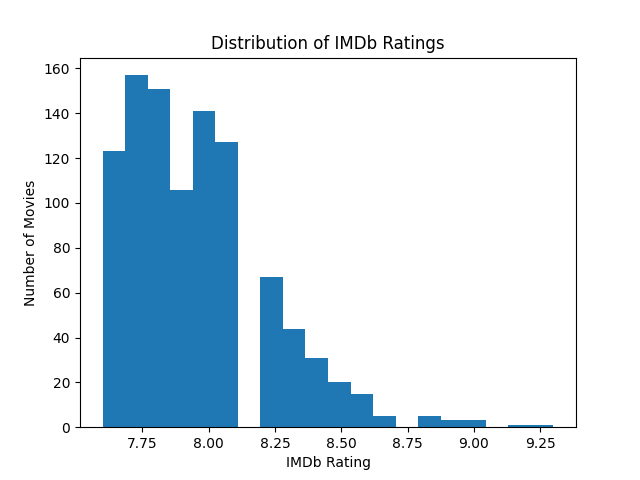
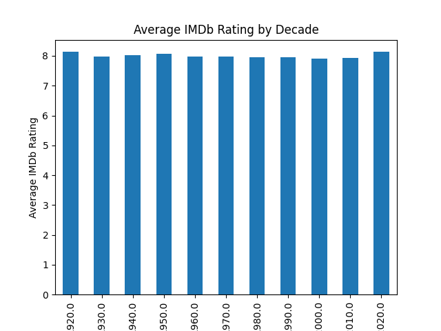
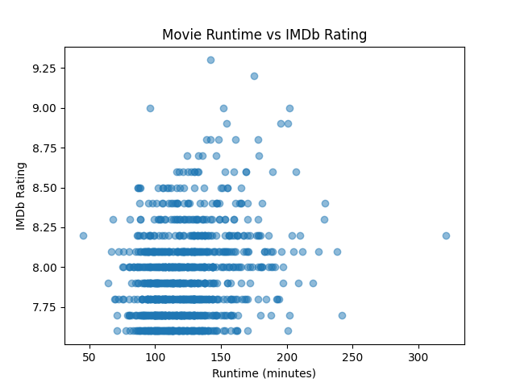

# Movie Ratings Analysis

## Goal
The goal of this project is to explore which factors are associated with higher IMDb ratings using basic Python data analysis techniques.

## Dataset
- Source: Kaggle (uploaded by Harshit Shankdhar)
- Number of movies: 1000
- Columns used: 5  
  - Series_Title  
  - Released_Year  
  - Runtime  
  - Genre  
  - IMDB_Rating  

## Questions
- What is the average IMDb rating of movies in this dataset?
- Do IMDb ratings change over time?
- Is there a relationship between movie runtime and IMDb rating?

## Method
- Selected relevant columns from the original dataset  
- Converted text-based columns into numeric values  
- Handled missing values  
- Grouped movies by decade  
- Created visualizations using matplotlib  

## Results
- The average IMDb rating in the dataset is approximately **7.95**.
- IMDb ratings remain fairly consistent across decades, generally ranging between **7.9 and 8.1**.
- There is no strong relationship between movie runtime and IMDb rating.

### Visualizations
  
  

## Limitations
- The dataset includes only 1000 movies and may not represent all IMDb movies.
- Other factors such as budget, director, or number of votes were not analyzed.
- Correlation does not imply causation.

## Next Steps
- Analyze ratings by genre
- Include additional features such as number of votes or director
- Use larger datasets
- Explore basic statistical correlations